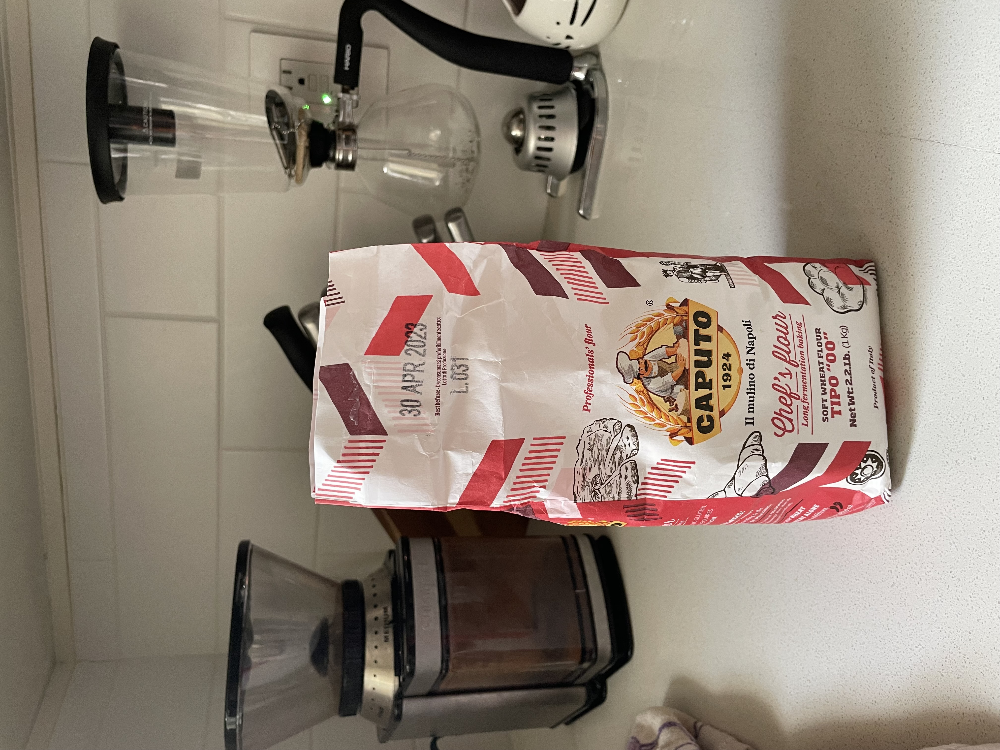

# Pizza

## Ingredients

Refer to this picture for list of ingredients except for the yeast: this original recipe calls for 24hrs rise, but here I do about 3 total. Therefore I use 3.5 grams (half a packet) if I do less than 4 pizzas, and 7 grams if I do 4 to 6 pizzas.

|  |
|:--:|
| Ingredients and quantities. Yes, it is in Italian. |

This is the flour I use, but I tried:

* all purpose
* regular bread flour
* a 70/30 mix of bread flour and whole wheat bread flour (add 5% more water)

My conclusions are that 00 flour is the best but all the others kind of work too

|  |
|:--:|
| Yoda says: not the brand, is important, but the double zeros |

## Other ingrediends

I had excellent results with:

* Kirkland organic tomato sauce
* Trader Joe's Mozzarella log

## Items needed

* Bowls, so many bowls, of all sizes
* Pizza stone for best results, but an upside down metal pan works too (not as well, but still, pizza)
* A kitchen scale AND measuring cups. I did a horrible job at keeping it consistent
* A bunch of kitchen towels
* A large kitchen pan to use on the stove, as large as you want your pizza to be. This is for the combo method
* Best if you have a pizza peel and an infrared thermometer

## Protocol

1. If you use dry yeast, this is the time to put it in 1/8 cup of water, half a teaspoon of sugar, and put it in the oven with the light on (or in any place where it can happily stay at 30C)
2. Put the salt in 1/8 or 1/4 cup of water, and stir well. DO NOT ADD THIS TO THE DOUGH YET. Every time I added it to the dough I had issues with rising.
3. Once the yeast starts bubbling, knead all the flour, water, and yeast. How long? If you have a standing mixer, 5 minutes will be enough. If you do that by hand, it will be more like 10 minutes.
4. Put the dough to rest, in a covered and lightly floured bowl, in the oven with the light on (or the same 30C place where you put the yeast - henceforth referred to as “The 30C Place”) for 30 minutes. I do that because every time I mix salt and yeast together, the yeast dies and my dough doesn’t rise.
5. Mix the salt water (brine?) with the dough. It will be a mess at first. Have faith and do not add any flour here. Just keep mixing. If you do not have a standing mixer you probably should do this inside a large bowl.
6. As in 5, do not lose faith in the ingredients’ proportions. Keep kneading until your dough passes the [windowpane test](https://www.thekitchn.com/bakers-techniques-how-to-do-th-70784). Let it rest (still in the bowl) for 20 minutes in The 30C Place (T30CP, cannot write that every time).
7. Now we move to the “areation” phase of the dough. Put some flour on a flat surface, put the dough on it, and poke it with your fingers until is kind of flat. It does not need to be stretched. Then fold the dough on itself once, poke with fingers, fold again, poke with fingers, fold again and make a ball of it. Summarizing: poke, fold, poke, fold, poke, fold, ball it.This process incorporates a lot of air in the dough so that it fluffs up.
8. Put back in T30CP for 10 minutes (still in a bowl). I think I got this from the book of a famous San Francisco Bakery whose name starts with T and it rhymes with thirtheen.
9. Poke, fold, poke, fold, poke, fold, ball. Back in T30CP for 5 minutes.
10. Poke, fold, poke, fold, poke, fold, ball.
11. Now it’s time to let the dough rest for the first hour in T30CP, in a bowl, if that wasn’t clear.
12. After the hour(-ish) is past, take the dough out and start making the balls. You will need to put the balls in some sort of ROUND container, with a lid or some transparent film to close it. It needs to be round otherwise it is more difficult to get a round pizza. If you want to do a pan pizza in a square pan, use a square container. For a pizza I usually do 220g, for a focaccia I do 280g to 300g as I like it a bit thicker.
13. Some people put flour in the balls’ containers. I like to do spray oil, just do not overspray.
14. The technique for making the balls is also called [“pirlatura”](https://www.youtube.com/watch?v=z4GgWcMNufM\&themeRefresh=1). This guy actually makes another round of folding. I don’t think that’s needed, and I never do it. The main point is to stretch the top of the ball towards the bottom, without breaking the surface. When you feel tension on the surface, that’s the time to stop.

## Rising

The rising sub-protocol depends on what you want to do: quick rise or overnight rise.

### Quick rise

Put the ball containers to rest in T30CP until they rise again. Usually it takes mine 1.5 hours.

### Overnight rise

Thi is the traditional way to do it. I noticed that the resulting pizza is much lighter and tastes less like yeast like this. 
Put the ball containers in the fridge for 18 hours. After that, take them out of the fridge and put them in T30CP for 5 hours. Have faith and patience

## Cooking the pizzas
I strongly recommend the [the Combo Method by Gigio Attanasio](https://www.youtube.com/watch?v=oGYadIZmloA). He also has great suggestions on how to stretch the dough with, guess what, a bowl (at 1:46). I owe this guy my mental health during the pandemic.

1. Take the balls out of the oven, put the containers on a non-stone surface (cutting board or a few kitchen towels to insulate the container from a cold stone), cover them with kitchen towels or even a bathroom towel (clean please) and heat up the oven, with the stone in, at 420F. Important: the stone needs to be as close to the heating element as possible. Use the highest rack in your oven (as long as there is space for the pizza)
2. When your oven is at 420F, put it to Broil HIGH and heat up the big pan ON THE STOVE. If you have an infrared thermometer, the sweet spot is 260C (sorry for the C/F mix). Otherwise keep it at medium heat.
3. Stretch your balls on a surface with a decent amount of flour
4. Put the stretched pie in the pan on the stove. I usually poke it with my fingers a bit more in the first 30 seconds or so, it helps stretch it a bit more.
5. PIZZA: Put your condiments on the pizza. I usually cover it now to keep moisture in and to melt the mozzarella, but try both ways, it’s subjective.
6. FOCACCIA: brush the surface with oil, sprinkle salt on top (rosemary if you like it)
7. Use a spatula to gently lift the pizza. When you start seeing dark marks underneath, it’s time to transfer it to a peel (or flat sheet pan) and then in the oven. Have flour on the peel and make sure the pizza slides properly on it.
8. Keep it in the oven for 30 seconds, take it out, turn it 180 degrees, put it back in for 30 seconds.
9. Enjoy. The next picture is literally the first pizza I made with the combo method.

|  |
|:--:|
| First pizza with the combo method.|

## Reference pictures:

|  |
|:--:|
| Windowpane test on a 70/30 white flour/whole wheat flour dough. It does not look optimal because I am taking the picture with one hand and trying to create a windowpane with the other hand. This is about 900 grams of dough pulling from the bottom, and the dough is so strong that it didn’t break (brag).|


Poke/fold steps. From left to right, top to bottom: 

* dough after 20’:
* example of poke/fold:
* ball

|  |
|:--:|
| Poke/fold steps. From left to right, top to bottom: dough after 20’, example of poke/fold, ball: look at the bubbles on the ball: we want bubbles, bubbles are great. |



