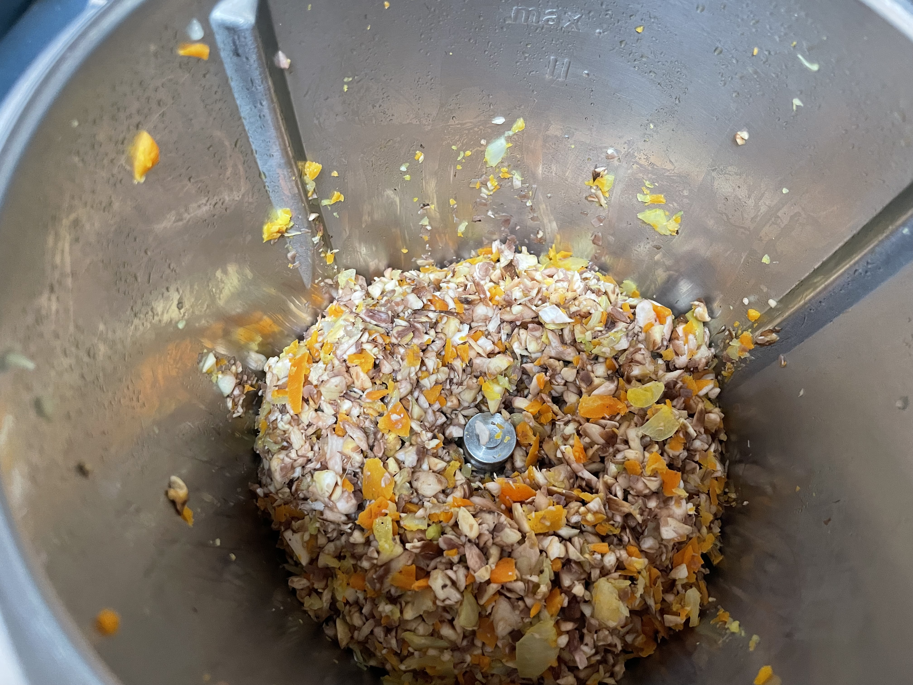
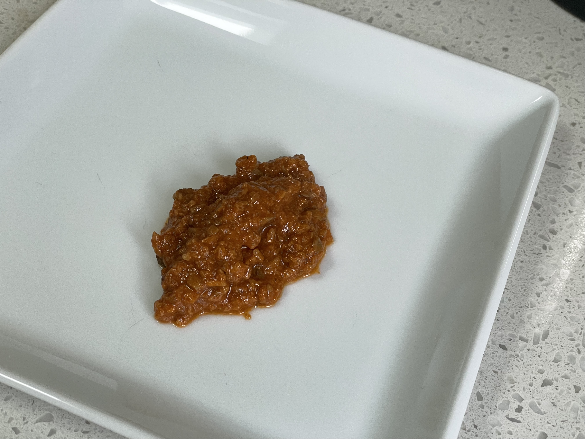
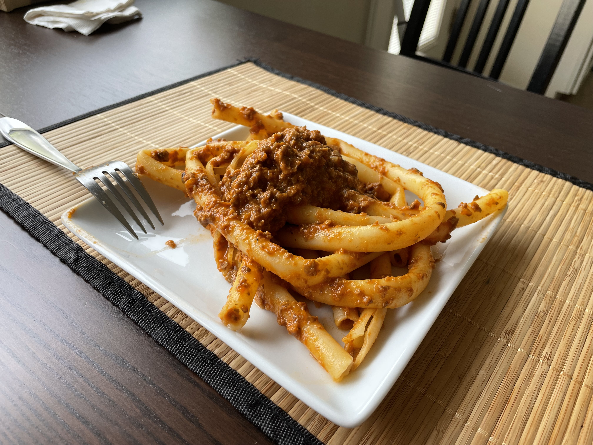

# Impossible ragu

As in "it is impossible that this is so good even though I did not follow the recipe".
A surprisingly resilient recipe, it turns out great every time, no matter the variant.
I tend to make it with Impossible meat and mushrooms, but over the years I tried with any possible combination (see variants below)

4 servings of sauce.

## Ingredients

1. A pack of ground Impossible burger or whatever alternative meat you want to use. I think it's 2/3 of a pound
2. 1lb mushroom.
3. 1 medium carrot
4. 1/2 onion
5. a piece of celery, maybe 5 inches of a stalk
6. 1 can of tomato sauce
7. 50ml (whatever is that in cups) of white wine, or red wine, or, if you want to be extra fancy, bourbon (brandy also works)
8. Olive oil, I want to say 1 tablespoon
9. Mandatory spices: salt (1tsp), ground black pepper (1/2 tsp) , red pepper (pinch)
10. Optional spices: thyme, sage, turmeric, a pinch of each
11. Optional: a pinch of msg

## Variants

This works very well with mushroom only, with Impossible only, or with real meat, just double the amount so that you get to 2 pounds of material (either mushroom, impossible, or beef). If done with real meat, you can use a blend of beef and pork, beef pork and lamb, just do not use chicken, you would be wasting your time.

## Protocol

1. Chop onion, carrot, and celery. I use a mixer, they need to be chopped fine.
2. Put the chopped vegetables in a pot with a tablespoon of olive oil and let them cook until the onions are translucent, stir them so that they don't burn
3. In the meantime chop the mushrooms. I blitz the mushrooms with a mixer as well.
4. Once the vegetables are done, add the mushrooms and the spices, let them cook until they change colors
5. Add the wine/bourbon (and msg if you want)
6. Let everything cook for 5 minutes at medium/high
7. Add the meat, in whatever flavor
8. Let it cook until the meat changes color at medium high
9. At this point add the tomato sauce, then put half a cup of water in the can to recover all the stray sauce, and add that to the pan.
10. Bring it to a simmer, and then partially cover (leave only some space for steam to get out) and cook for 25 minutes at low if you are using a mushroom/fake meat mix. If you put real meat you want to cook this for at least an hour at low, still partially covered. Be careful, it's going to sputter like an active volcano. Stir once in a while, and keep an eye on the consistency. I like my ragu a bit "dry" so I let most of the liquid evaporate. My family likes it wetter, the heathens, so it's subjective.

## Pictures

|  |
|:--:|
| this is how you want the mushrooms (before cooking) |

|  |
|:--:|
| The ragu after cooking |

|  |
|:--:|
| this is ziti (which I didn't break, but one should) with the ragu |
