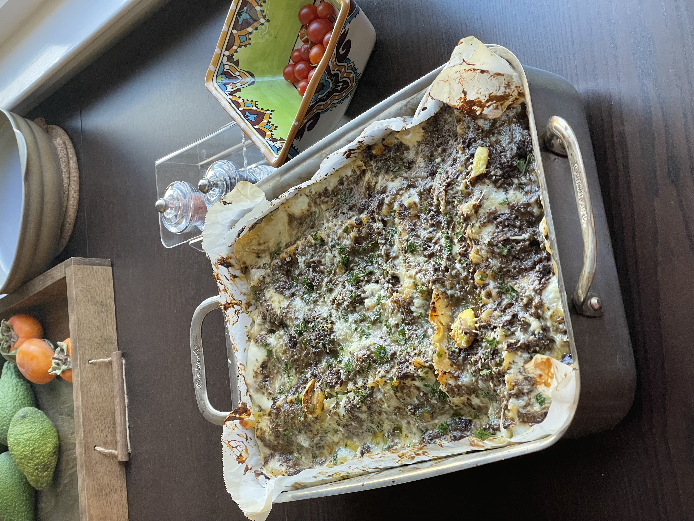
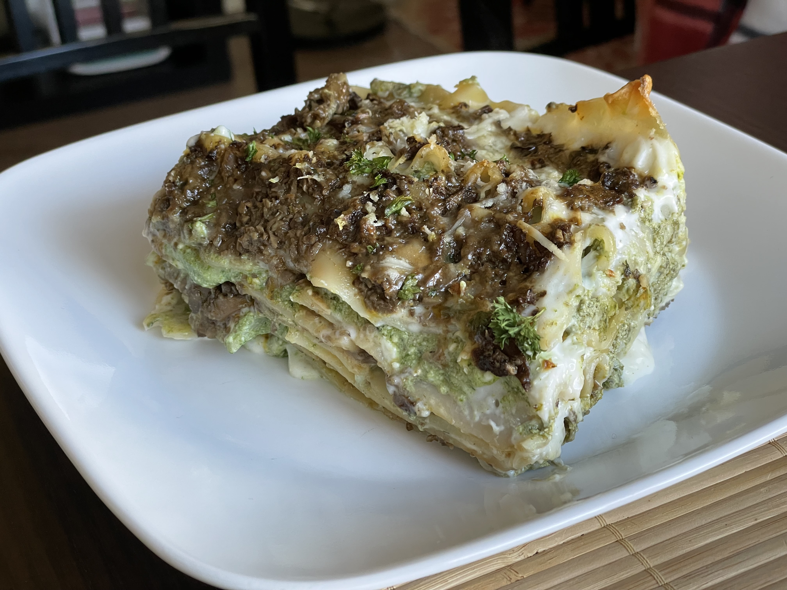
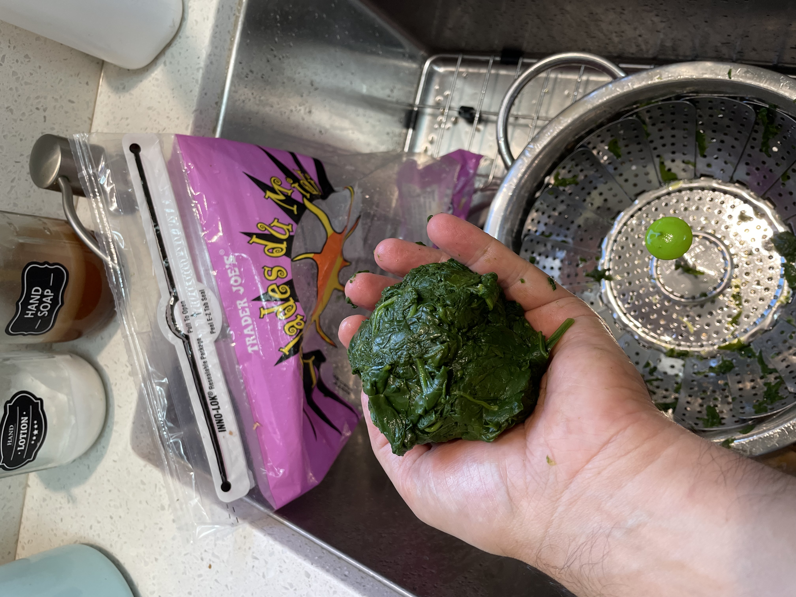

# Mushroom lasagna (experimental)

I really really wanted to make mushroom lasagnas with no red sauce but I am not sure these are the definitive quantities, so I will revisit it after I digest these.

I use a layer of ricotta and spinach because they are more scrumptious, but it's not in the lasagna recipe I grew up with. It is delicious though.

I usually make a giant pan so this should easily serve 8 people or 4 very hungry ones.

Also this takes me about two hours if another person helps me, otherwise I'd set aside three or four hours.

This is the final result. I liked them, but I don't quite like the green look of the filling. Next time I will probably make it whiter.

|  |
|:--:|
| A whole pan after cooking. I regret putting the garlic on top. |

|  |
|:--:|
| A single serving. Next time I might make the ricotta filling a bit less green |

## Ingredients

### Bechamel sauce

* 1000 gr milk
* 70 gr flour
* 80 gr butter
* 1 tsp salt
* 1/4 tsp ground black pepper
* 1/4 tsp ground nutmeg

### White-ish mushroom sauce

* 2lb portobello mushrooms, I use already sliced ones, they are just easier
* 3 garlic cloves
* a bunch of parsley, finely chopped
* 2 tbsp concentrated tomato paste (regular tomato paste is fine). If you don't have tomato paste, 1/2 cup tomato sauce
* 1/4 tsp turmeric
* 1/4 tsp cayenne pepper
* 100ml of bourbon
* 1/2 tsp salt

### Ricotta and spinach filling

* 340 gr/ 12oz fresh spinach. I use a whole Trader Joe's bag.
* 1lb ricotta
* 2 large eggs
* 150 gr grated parmigiano or pecorino romano. I guess any sharp cheese would work
* 1/2 tsp salt
* 1/4 tsp nutmeg
* 1/4 tsp black pepper
* Breadcrumbs, for emergencies

## Protocol

### Bechamel sauce

There are countless bechamel protocols in there, if you have one that works for you use that. This is a looser bechamel sauce, I want it a bit more liquid than usual.  

What I found works best for me is:

1. melt the butter on medium heat
2. put flour in it and whisk it until there are no more clumps
3. add the milk little by little, then salt and spices
4. Let it on medium stirring constantly until it reaches a custard-y consistency

### White-ish mushroom sauce

1. Blitz the mushrooms in a food processor or chop them fine. I like them very fine, but anything really works (except whole). Check the reference picture.
2. Warm up some vegetable oil with garlic, 3/4 of the parsley (the rest is for topping), pepper, turmeric, and cayenne pepper in a large pan at medium-high heat
3. When the garlic starts frying put the mushrooms in the pan and sautee them
4. They will lose water, let half of it evaporate (all of it if you use tomato sauce)
5. Add bourbon and tomato paste, let some of the bourbon evaporate
6. Adjust salt and pepper.

This is the final result: note the pockets of liquid:

|  |
|:--:|
| "Not really white" mushroom sauce |

### Ricotta and spinach filling

1. Steam the spinach
2. Squeeze as much water as you can from the steamed spinach. Check the reference picture to see what a whole bag of spinach yields.
3. Chop the spinach in a food processor (again, you can use a knife too, it just takes longer)
4. Mix ricotta, spinach, cheese, spices
5. Taste and adjust the salt.
6. Add the two eggs, stir
7. If it looks too runny add a tablespoon of breadcrumbs, stir again, repeat if necessary

### The pasta

In my last attempt I used ready made lasagna sheets. They were dry pasta so I boiled them first. Eventually I'll put a recipe for fresh pasta in here as well

### Assembling

In a large oven pan, assemble like this:

1. Thin layer of bechamel sauce
2. Layer of pasta
3. Layer of a bechamel/ricotta filling sauce
4. Layer of bechamel/mushroom sauce
5. Repeat 2,3,4
6. The top layer needs to be bechamel/mushroom, so be careful
7. Sprinkle grated cheese and fresh parsley on top
8. Put in the oven for 30 minutes

## Reference pictures

|  |
|:--:|
| This is how small I like the mushrooms to be |

|  |
|:--:|
| seriously, this is a whole bag of spinach after steaming and squeezing the water out |