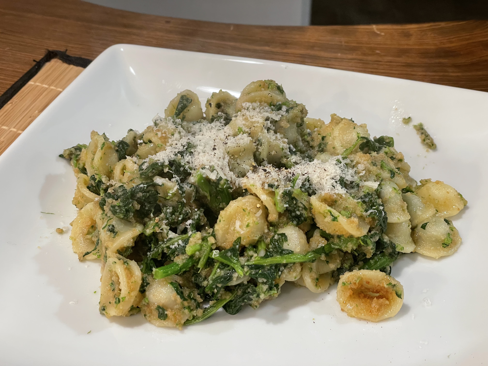

# Orecchiette with broccoli rabe

But really, any (short) pasta will work with this recipe.

## Ingredients for 4 people

* Orecchiette. Whole Foods sometimes has them fresh. However, I tried this with penne or rotini/fusilli and it still works.
* Broccoli rabe, 2 bunches. One might be enough, but I like a lot of condiment with my pasta.
* Pecorino romano, grated/shredded, to taste
* 2 garlic cloves
* 1/4 cup breadcrumbs
* White wine (about 1/8 cup or 30ml)
* Olive oil

## Recipe

I believe the original recipe just calls for boiling the rabes and putting the pasta in the same water (with the rabes still there), but I prefer them sauteed with garlic after a short time in the water (may be blanching?).

1. Clean up the hardest part of the rabes
2. Put them in boiling water for about 5 minutes
3. Get them out of the water with a spatula, and try to recover as much of the water that comes up with them (put it back in the pot), even try to squeeze it back in the pot. DO NOT THROW THE WATER. That water is flavorful and will be reused for boiling the pasta
4. I cut them a bit at this point, but there's no real need. Some people like to keep them super long
5. Put one or two tablespoons of olive oil in a pan and let it heat at medium
6. This is the time to throw the pasta in the water where you boiled the rabes. Follow the instructions on the pasta for the boiling time. Consider using [the passive boiling method](https://www.barilla.com/en-gb/passive-cooking). You might have to try it a few times but it's worth.
7. Sautee the rabes in a pan with garlic and red pepper. When they start to fry a bit add the wine, and let evaporate most of it, not all.
8. (Optional) the original recipe calls for salted anchovies to be incorporated at this point
9. When the pasta is ready drain it but **save some cooking water**, maybe a cup, and toss it in with the rabes. Let it go for a couple of minutes at high. Put 1/4 cup of cooking water a tablespoon at a time.
10. When there is very little cooking water left put in the breadcrumbs and mix.
11. Serve and sprinkle with grated pecorino romano and black pepper
